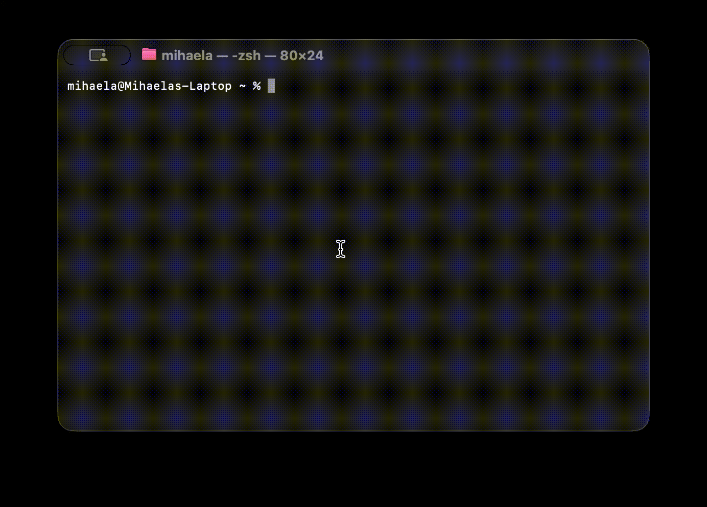
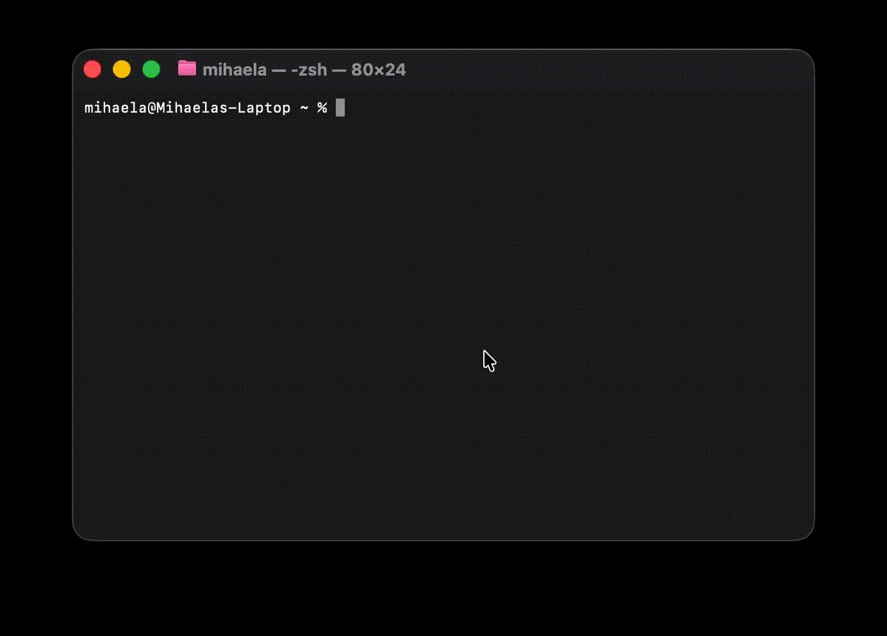
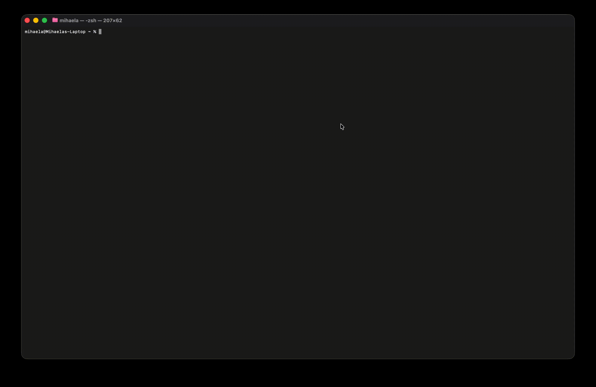
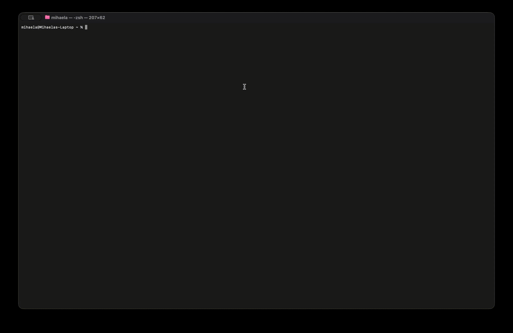

# go2web

A command-line HTTP client built from scratch using **raw TCP sockets** — no HTTP libraries allowed.  
Implements HTTP/1.1 over TCP, HTTPS via TLS, redirect following, in-memory caching, and content negotiation.

---

## Installation

```bash
git clone https://github.com/mihaelaaa-23/tum-web-lab5
cd tum-web-lab5
chmod +x go2web go2web.py
sudo ln -s "$(pwd)/go2web" /usr/local/bin/go2web
```

> Requires Python 3.9+. No third-party dependencies.

---

## CLI Reference

```
go2web -h                          Show help
go2web -u <URL>                    Fetch URL and print human-readable response
go2web -s <search-term>            Search and print top 10 results
go2web -s <search-term> <n>        Fetch the nth search result directly
go2web --cache-demo <URL>          Demonstrate in-memory cache (two fetches, one TCP connection)
```

---

## Demo

### `-h` — Help


### `-u` — Fetch a URL


### `-u` — Redirect following (HTTP → HTTPS)


### `-u` — Content negotiation (JSON response)


### `-s` — Search


### `-s <term> <n>` — Fetch search result by index


### `--cache-demo` — In-memory cache


---

## Features

| Feature | Description |
|---|---|
| Raw TCP sockets | All HTTP/HTTPS requests use `socket` module directly |
| HTTPS | TLS wrapping via Python's built-in `ssl` module |
| Redirect following | Follows `301`, `302`, `303`, `307`, `308` up to 5 hops |
| HTML stripping | Removes tags, decodes entities, collapses whitespace |
| Search | Queries Yahoo Search over raw TCP, extracts top 10 results |
| Result fetching | `-s <term> <n>` fetches the nth result directly |
| In-memory cache | Repeated requests to the same URL skip TCP within a session |
| Content negotiation | Sends `Accept: application/json, text/html` — pretty-prints JSON automatically |

---

## Implementation Details

### HTTP Request (raw TCP)
```
GET /path HTTP/1.1\r\n
Host: example.com\r\n
Connection: close\r\n
...\r\n
\r\n
```

All requests are constructed and sent manually as byte strings over a `socket.SOCK_STREAM` connection.  
HTTPS uses `ssl.create_default_context().wrap_socket()` — no third-party TLS libraries.

### Chunked Transfer Encoding
Responses with `Transfer-Encoding: chunked` are decoded manually by reading hex chunk sizes line by line.

### Content Negotiation
Every request includes:
```
Accept: application/json, text/html;q=0.9, */*;q=0.8
```
The response `Content-Type` header determines whether output is pretty-printed JSON or stripped HTML.

### In-Memory Cache
A module-level `dict` maps URLs to raw responses. Within a single process, any repeated `fetch_url()` call returns the cached response without opening a new TCP connection.

---

## Project Structure

```
tum-web-lab5/
├── go2web          # executable wrapper script
├── go2web.py       # main implementation
└── README.md
```
